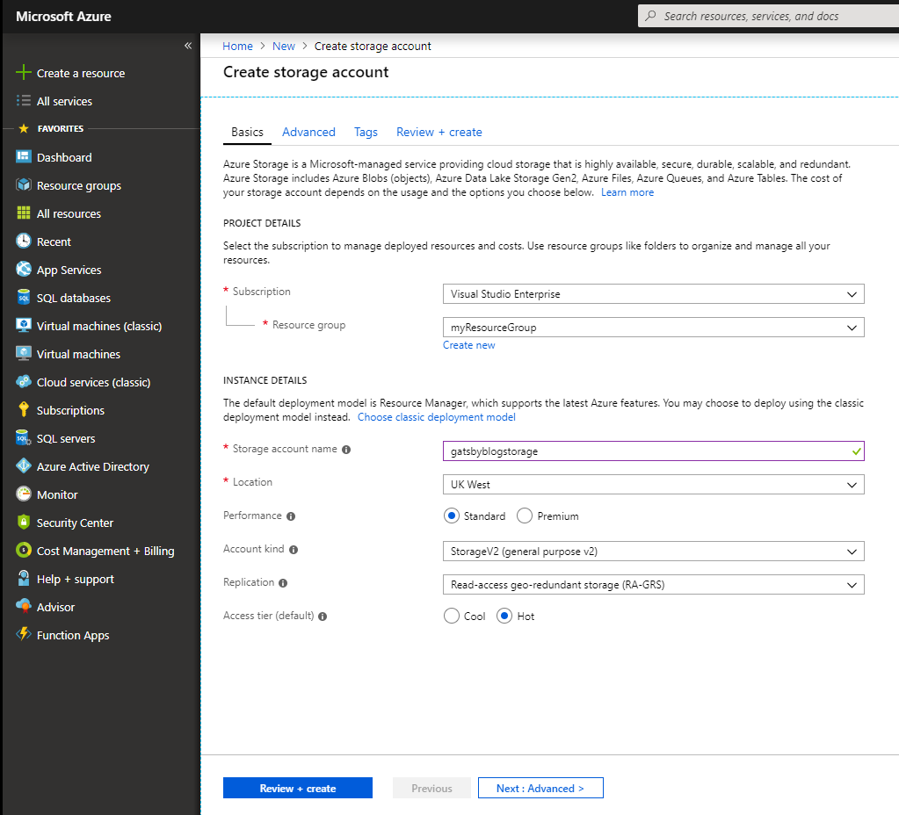
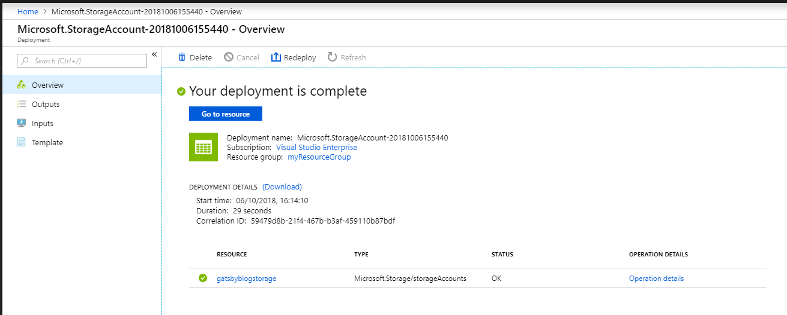
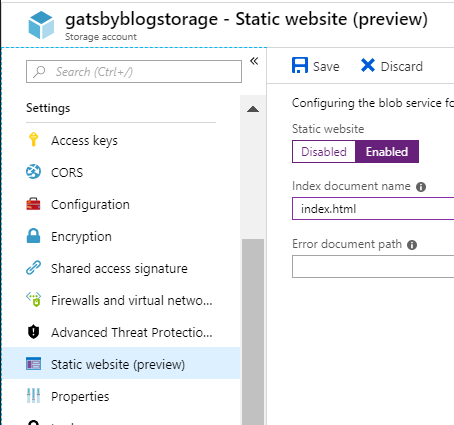
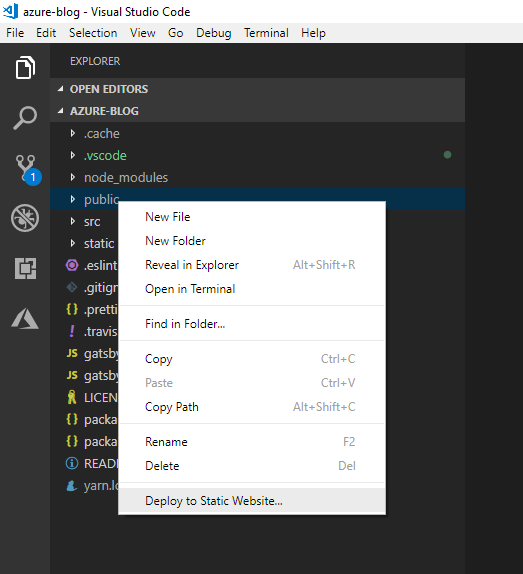

In this post we will walk through the process of deploying a Gatsby blog to Microsoft Azure Storage using VS Code.

## Prerequisites

To complete this tutorial you will need the following tools:

- Node - To run the rest of the tools
- Gatsby CLI - To create your blazingly fast blog!
- VS Code - as a code editor

### Prerequisites Installation

Install Node from the [Node website](https://nodejs.org/en/) and check it's installed by checking the version from your terminal.

```bash
$ node -v
$ v10.9.0
```

Install VS Code from the [VS Code website](https://code.visualstudio.com/).

Next, we can install the important part! [Gatsby](https://gatsbyjs.org/) from your terminal, run:

```bash
$ npm install --global gatsby-cli
+ gatsby-cli@2.4.2
updated 1 package in 4.868s
```

## Creating your blog

Next you will create the blog from the handy [Gatsby Starter Blog](https://github.com/gatsbyjs/gatsby-starter-blog).

> If you already have a site you want to deploy, skip forwards to [Setting up Azure](#setting-up-azure)

From your terminal run

```bash
$ gatsby new azure-blog https://github.com/gatsbyjs/gatsby-starter-blog

info Creating new site from git: https://github.com/gatsbyjs/gatsby-starter-blog.git
Cloning into 'azure-blog'...
remote: Enumerating objects: 1, done.
remote: Counting objects: 100% (1/1), done.
remote: Total 1139 (delta 0), reused 0 (delta 0), pack-reused 1138
Receiving objects: 100% (1139/1139), 2.14 MiB | 2.95 MiB/s, done.
Resolving deltas: 100% (636/636), done.
success Created starter directory layout
info Installing packages...
...
```

You can now view your website by running

```bash
$ cd azure-blog
$ gatsby develop
```

You should now see your blog in the flesh!


## Setting up Azure

Microsoft Azure is a cloud hosting provider which offers a wide range of tools and services. Today you are going to use Azure Storage to host our static Gatsby blog.

> If you don't have an Azure account, [sign up today](https://azure.microsoft.com/en-us/free/) for a free 30 day account with $200 in Azure credits.

> Note: You will need to verify your identity with a credit card, but will not be charged unless you begin to use paid service and exceed the free allowance. The cost per GB for storage is in the region of £0.04 so it should last a while.

As part of this tutorial you will:

- Create an `Azure Storage Account` for our blog
- Install the `Azure Storage` VS Code extension
- Create a production build of your blog
- Deploy your blog to Azure

### Create the Azure Storage Account

Login to the [Azure Web Portal](https://azure.microsoft.com/en-gb/features/azure-portal/) and select `+ Create a Resource`, find and select `Storage Account` in the list.

Fill in the form by selecting your subscription, creating a new resource group if you don't have one and giving your storage account a name and region. Your form should look something like this.



Click on `review + create` then `create`, after a few seconds, your account will be created.

Next, click on `Go to resource`



### Setup your account for static site usage

Find the `Static Website (preview)` link in the left hand panel and select it.

Change the option to `enabled`, set a default document name of `index.html` and hit `Save`.



> Note down the `Primary Endpoint` that azure gives you, that will be the web address that our blog will be deployed, it will be in the format (https://<the-name-of-your-storage>.<the-zone>.web.core.windows.net/)

### Create a production Gatsby build

You are now ready to produce a production build of your blog. Make sure you're in the blog folder and then run.

```bash
$ gatsby build
success open and validate gatsby-config — 0.010 s
success load plugins — 0.352 s
success onPreInit — 2.785 s
success delete html and css files from previous builds — 0.041 s
success initialize cache — 0.009 s
success copy gatsby files — 0.139 s
success onPreBootstrap — 0.016 s
success source and transform nodes — 0.147 s
success building schema — 0.521 s
success createPages — 0.072 s
success createPagesStatefully — 0.037 s
...
```

This will output a production build of your blog into the `public` folder.

## Install the Azure Storage extension

The easiest way to deploy your blog to your storage account is to use the `Azure Storage Extension` within VS Code.

[Install the Azure Storage Extension - VS Code](vscode:extension/ms-azuretools.vscode-azurestorage)
[Install the Azure Storage Extension - Extensions Gallery](https://marketplace.visualstudio.com/items?itemName=ms-azuretools.vscode-azurestorage)

> Alternatively, select the extension option from VS Code and search for `Azure Storage`.

## Deploy your blog

Now you can finally deploy your blog!

Right click on the `public` folder in VS code and select `Deploy to Static Website...`.



If you haven't logged in before, this will show you a prompt in VS Code where you will need to select `Sign in to Azure`.


You will see a dialog in the bottom right, asking you to load a webpage and enter a device code. Click on `Copy & open` and enter the code provided.


The webpage should show you are trying to link your Azure device to VS Code, click `Continue` and login to Azure if you weren't already.

If everything worked correctly you should see a page confirming you signed in.


You can now return to VS Code and select your subscription and then your storage account. There will only be one option for each.

Selecting the storage account will begin the deployment.

> If you have previously deployed you will see a dialog asking if you want to delete your files and redeploy.

Next you will see a message in the bottom right of VS Code confirming that your blog has been deployed.


Good news! you can now browse to your blog! congratulations! you've just deployed your Gatsby blog to Azure!
